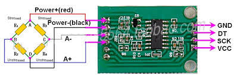
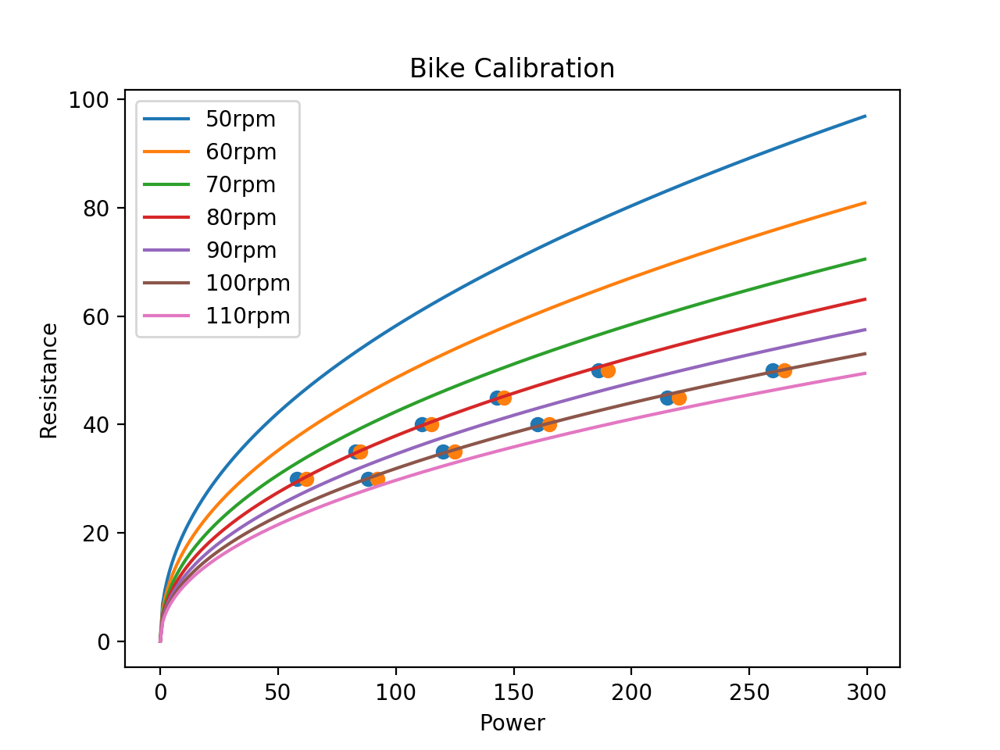

# powerMeter
This project is a power meter for a bike that computes power, cadence, and resistance similar to a peloton bike.  For those of us who just have simple exercise bikes and a peloton digital subscription, this helps provide objective numbers to match to the instructors' cadence and resistance measurements.

The solution I came up here uses a sensor unit attached to your bike crank, along with a display unit you attach to your handlebars.  The two units both use the [Arduino Nano 33 BLE](https://store.arduino.cc/usa/nano-33-ble) microprocessor.  For the sensor, the Nano 33 BLE is nice because it is tiny, it has an integrated IMU to give you a gyroscope for cadence, it has enough pins to interface with the force sensors, and it uses low power bluetooth 5.0.  For the display, it gets tight but has just enough GPIO ports for the cheap 7-segment LEDs I chose, and of course has bluetooth 5.0 to recieve the data from the sensor.  For powering both, I use 4x AAA rechargable batteries. 

I also 3D-printed the cases for the sensor and display.

## powermeterSensor
This is the thing you attach to the bike crank. The key sensor here is the [HX711](https://smile.amazon.com/gp/product/B07MTYT95R) configured in a [wheatstone bridge](powermeterCommon/HX711_circuit.jpg).

### Algorithm
```
void setup() {
    set up bluetooth characteristics for read, notify
}
void loop() {
    read sensors
    compute new values
    if values change,
        write to bluetooth characteristics
}
```

### Power

Power meters measure the amount of force you exert on the bike crank.  This uses a strain gauge, similar to what is in a typical weight scale.  For some more background, take a look at [this student project](https://digitalcommons.calpoly.edu/cgi/viewcontent.cgi?article=1292&context=cpesp), which helped me get started.

#### Strain gauges

When a strain gauge is stressed, the resistance changes.  You can read the voltage across that resistor to detect the amount of change.  The problem is that this is a very noisy system, so people typically use a [Wheatstone Bridge](https://en.wikipedia.org/wiki/Wheatstone_bridge) circuit.


In a Wheatstone Bridge such as the one in the figure above, you can apply a known voltage across A and C, then measure the output voltage across B and D.  If you apply 4 strain gauges on the bike crank in the right places, you can get it so an increase in resistance in R1 will also result in a reduction in resistance in R2, amplifying the change while introducing some redundancy (which is good).

#### Amplifier

The resistance change from the strain gauges is still very small, so we need to amplify it.  To do that, most people use an [HX711](https://cdn.sparkfun.com/datasheets/Sensors/ForceFlex/hx711_english.pdf) circuit such as the one below. 



This circuit is fairly easy to use, cheap, and has a well supported [library](https://github.com/bogde/HX711) to simplify usage.

(TODO: show pictures of the install)

#### Computing Force

The instantaneous power of an angularly accelerating body is the torque ($&tau$) times the angular velocity ($&omega$).


Tau is just Force x Distance, so we get:


We'll get the force from the HX711, after calibrating and scaling.  r is the radius of the bike crank.  Angular velocity here is expected in radians/second, and the Arduino gives it to you in degrees/second, so we have to remember to multiply by a scale factor.  2pi radians is 360 degrees, so you multiply your dps by pi/180


Done.  

I skipped over calibrating and scaling the readings off the HX711, but it's relatively straightforward.  I assume zero weight when turning on the sensor, and use the first few seconds to read the neutral scale reading. That becomes the offset you pass to the `scale.set_offset()` function.  Then, I put a known weight (5 lbs in my case) on the pedal, and read the scale.  Each pound is 4.448 Newtons, so I set the scale factor to the reading divided by the weight I used times 4.448

(4.448\frac{N}{lb})})

### Resistance

Now this is the hard part.  Peloton listed official (Power,Resistance,Cadence) triples [here](https://www.reddit.com/r/pelotoncycle/wiki/index/faq/bikecalibration).  A nice user put those datapoints into a regression script and came up with equations [here](https://www.reddit.com/r/pelotoncycle/comments/gwpyfw/diy_peloton_resistance_output/).  


} )

I plotted the sample points and verified the equations seem to work in [this script](./powermeterCommon/calibrate.py).



So I just plugged in those equations, fixed up for cases where it would fall below zero and produce NaNs, and boom, done.

### Cadence

Cadence is easily sensed using the IMU on the Nano 33 BLE.  There's a simple `readGyroscope()` API.  You grab the z direction of that, and convert from degrees per second to revolutions per minute.

(TODO: explain the 16% magic scaling I had to do)

### Power supply

A key requirement is to have a power supply that is cabable of provided sustained current.  I initially started with some button batteries, but those would only last about 10 minutes before they started giving bogus numbers as a result of insufficient voltage to the chip.  Because of that, I moved to using 4xAAA rechargeable batteries.  This makes the cases slightly larger, but I believe they're still reasonably sized.

## powermeterDisplay

You could display the results on your phone, or another type of display.  For my bike, I wanted to play with some seven segment displays, so I got three [three-digit seven segment displays](https://smile.amazon.com/gp/product/B07GTQS4N5).

Pseudo-code is:
```
void setup() {
    set up bluetooth
}

void loop() {
    connect to bluetooth
    while connected to bluetooth{
        subscribe to notifications
        if values updated
            read values
        display
    }
}
```

### 7 segment displays

TODO

### Anything else?

TODO
