# powerMeter
This project is a power meter for a bike that computes power, cadence, and resistance similar to a peloton bike.  For those of us who just have simple exercise bikes and a peloton digital subscription, this helps provide objective numbers to match to the instructors' cadence and resistance measurements.

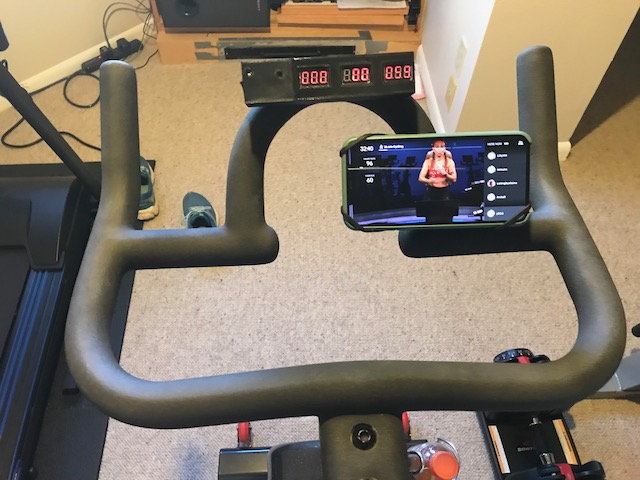
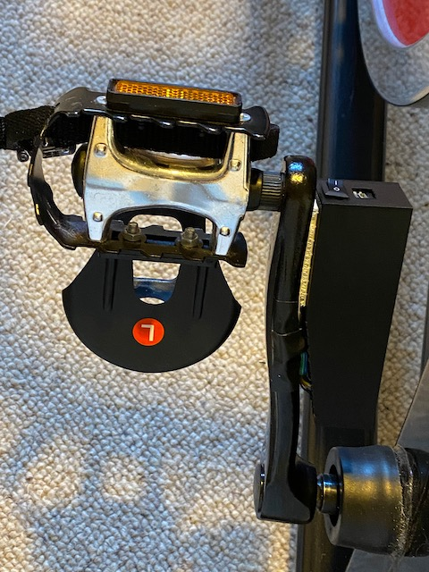

The solution I came up here uses a sensor unit attached to your bike crank, along with a display unit you attach to your handlebars.  The two units both use the [Arduino Nano 33 BLE](https://store.arduino.cc/usa/nano-33-ble) microprocessor.  For the sensor, the Nano 33 BLE is nice because it is tiny, it has an integrated IMU to give you a gyroscope for cadence, it has enough pins to interface with the force sensors, and it uses low power bluetooth 5.0.  For the display, it gets tight but has just enough GPIO ports for the cheap 7-segment LEDs I chose, and of course has bluetooth 5.0 to recieve the data from the sensor.  For powering both, I use 4x AAA rechargable batteries.

I also 3D-printed the cases for the sensor and display.

## powermeterSensor
This is the thing you attach to the bike crank. The key sensor here is the [HX711](https://smile.amazon.com/gp/product/B07MTYT95R) configured in a [wheatstone bridge](powermeterCommon/HX711_circuit.jpg).

### Algorithm
```
void setup() {
    set up bluetooth characteristics for read, notify
}
void loop() {
    read sensors
    compute new values
    if values change,
        write to bluetooth characteristics
}
```

### Power

Power meters measure the amount of force you exert on the bike crank.  This uses a strain gauge, similar to what is in a typical weight scale.  For some more background, take a look at [this student project](https://digitalcommons.calpoly.edu/cgi/viewcontent.cgi?article=1292&context=cpesp), which helped me get started.

#### Strain gauges

When a strain gauge is stressed, the resistance changes.  You can read the voltage across that resistor to detect the amount of change.  The problem is that this is a very noisy system, so people typically use a [Wheatstone Bridge](https://en.wikipedia.org/wiki/Wheatstone_bridge) circuit.


In a Wheatstone Bridge such as the one in the figure above, you can apply a known voltage across A and C, then measure the output voltage across B and D.  If you apply 4 strain gauges on the bike crank in the right places, you can get it so an increase in resistance in R1 will also result in a reduction in resistance in R2, amplifying the change while introducing some redundancy (which is good).

I attached the strain gauges to bike crank with a very thin layer of superglue.

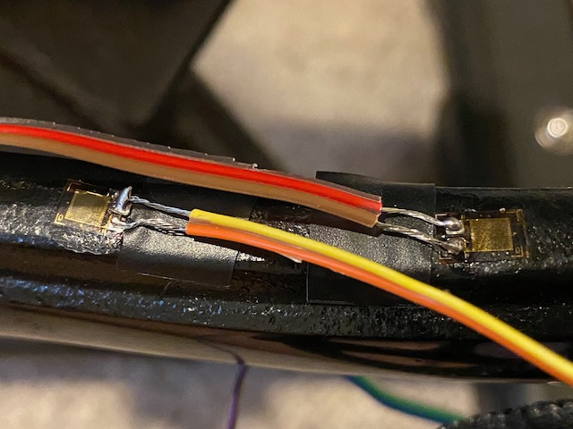

Using a bunch of electrical tape, I covered up all the wires and sensors on the bike crank, which ended up looking fairly clean.

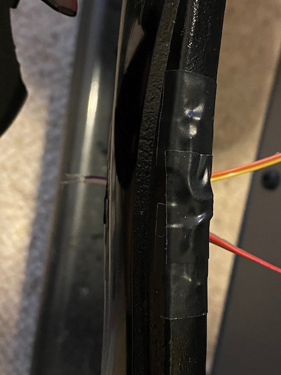

#### Amplifier

The resistance change from the strain gauges is still very small, so we need to amplify it.  To do that, most people use an [HX711](https://cdn.sparkfun.com/datasheets/Sensors/ForceFlex/hx711_english.pdf) circuit such as the one below.


This circuit is fairly easy to use, cheap, and has a well supported [library](https://github.com/bogde/HX711) to simplify usage.

#### Computing Force

The instantaneous power of an angularly accelerating body is the torque (tau) times the angular velocity (omega).


Tau is just Force x Distance, so we get:


We'll get the force from the HX711, after calibrating and scaling.  r is the radius of the bike crank.  Angular velocity here is expected in radians/second, and the Arduino gives it to you in degrees/second, so we have to remember to multiply by a scale factor.  2pi radians is 360 degrees, so you multiply your dps by pi/180


Done.  

I skipped over calibrating and scaling the readings off the HX711, but it's relatively straightforward.  I assume zero weight when turning on the sensor, and use the first few seconds to read the neutral scale reading. That becomes the offset you pass to the `scale.set_offset()` function.  Then, I put a known weight (5 lbs in my case) on the pedal, and read the scale.  Each pound is 4.448 Newtons, so I set the scale factor to the reading divided by the weight I used times 4.448

(4.448\frac{N}{lb})})

### Resistance

Now this is the hard part.  Peloton listed official (Power,Resistance,Cadence) triples [here](https://www.reddit.com/r/pelotoncycle/wiki/index/faq/bikecalibration).  A nice user put those datapoints into a regression script and came up with equations [here](https://www.reddit.com/r/pelotoncycle/comments/gwpyfw/diy_peloton_resistance_output/):

^{1.25}}\right)^{0.4651})

I plotted the sample points and verified the equations seem to work in [this script](./powermeterCommon/calibrate.py).


So I just plugged in those equations, fixed up for cases where it would fall below zero and produce NaNs, and boom, done.

### Cadence

Cadence is easily sensed using the IMU on the Nano 33 BLE.  There's a simple `readGyroscope()` API.  You grab the z direction of that, and convert from degrees per second to revolutions per minute.

In full disclosure, I had to multiply the cadence by (7/6) for some reason I haven't figured out yet.  Doing this, I exactly match the wahoo cadence sensor I already had.  Some day I should try to fix this, but if you know why I might be off by 7/6, please let me know.

### Power supply

A key requirement is to have a power supply that is cabable of providing sustained current.  I initially started with some button batteries, but those would only last about 10 minutes before they started giving bogus numbers as a result of insufficient voltage to the chip.  Because of that, I moved to using 4xAAA rechargeable batteries.  This makes the cases slightly larger, but I believe they're still reasonably sized.

### Measurements

Any measurement is going to have some noise to it.  To add some hysteresis, I created a `Measurement` struct that can take a `refreshInterval` (in milliseconds) and a way to reduce the results either via averaging or taking the max of a bunch of samples.  

In practice, I settled on about 2 seconds of samples, which ended up being about 20 samples.  For power, I expected to have to use max, but ended up using averaging, similar to cadence and resistance.

### Sensor board and case

For the circuit board, I used a 2cm x 8cm prototype [circuit board](https://smile.amazon.com/gp/product/B072Z7Y19F). That wasn't quite wide enough for the Arduino Nano, so I ended up only using pins on one side of the board, and snipped the headers on the other side so the whole Arduino still laid flat.  I did some clever wiring under the Arduino on the top side of the prototype board, which minimized the wiring underneath.  Next to the Arduino is the HX711, with the input pins soldered to 4 outward facing pins that I would attach the bike to.

Here is the fritzing image of the circuit.

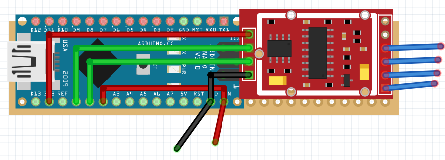

And here is the same thing in real life.

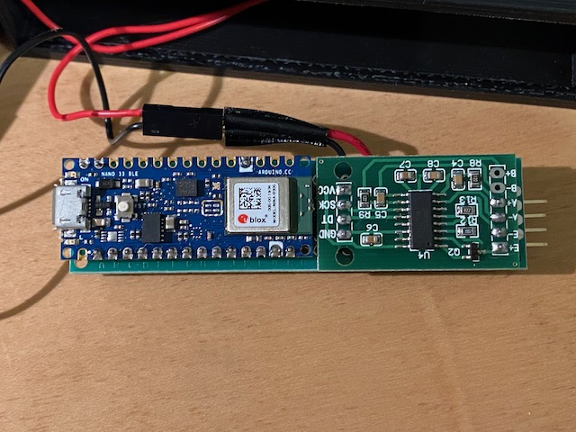

This is a picture of the batteries in the case.

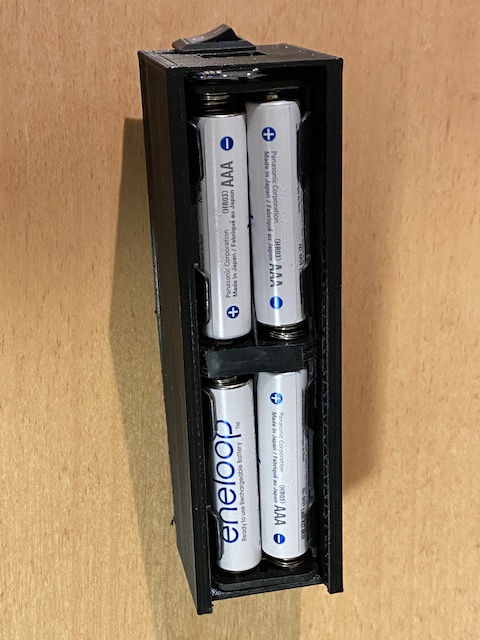

And finally, this is the case that I 3D printed for it.

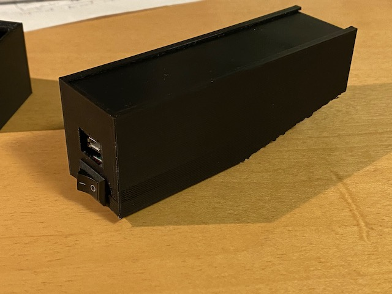


## powermeterDisplay

You could display the results on your phone, or another type of display.  For my bike, I wanted to play with some seven segment displays, so I got three [three-digit seven segment displays](https://smile.amazon.com/gp/product/B07GTQS4N5).

Pseudo-code is:
```
void setup() {
    set up bluetooth
}

void loop() {
    connect to bluetooth
    while connected to bluetooth{
        subscribe to notifications
        if values updated
            read values
        display
    }
}
```

### 7 segment displays

I bought [cheap 3 digit 7 segment displays](https://smile.amazon.com/gp/product/B07GTQS4N5/) (non-I2C) so it took a lot of the GPIO pins to drive.  This took a lot of wiring.

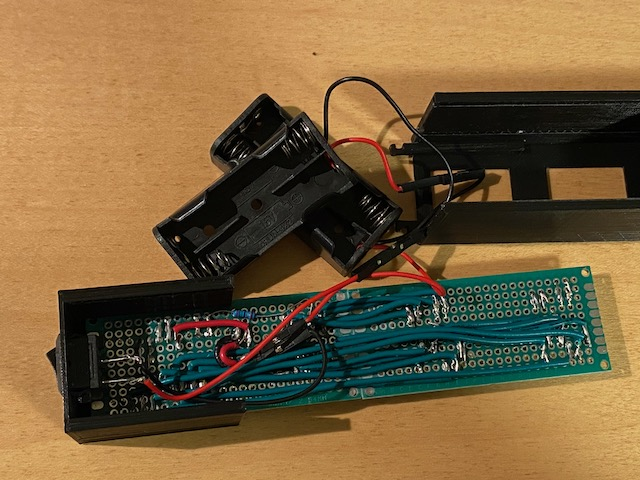

### Power supply

Just like the sensor, I had some issues with sustained voltage for the display.  I resorted to the same solution for the display, 4x AAA batteries.  For the display, it just extends the height of the case, so it's not a big deal.

### Display Board and Case

For the display, I used two of the 2cm x 8xm prototype boards, taped together.  This perfectly allows room for the Arduino and three 3-digit displays.  The wiring gets tight, but some careful planning solved that.

Here is the circuit board fritz on a much larger PCB.  Converting this to something that all fit in the 2cm x 8cm prototype board took a lot of planning, and using both the top and bottom side of the board.

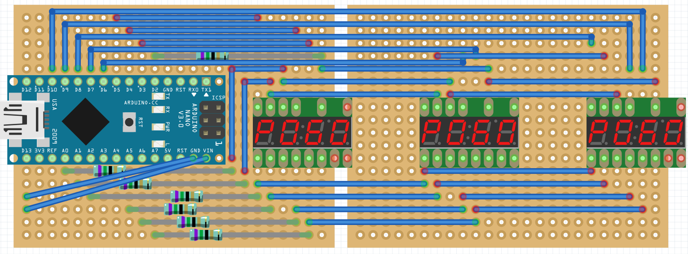

And here's a picture of the same thing in real life:

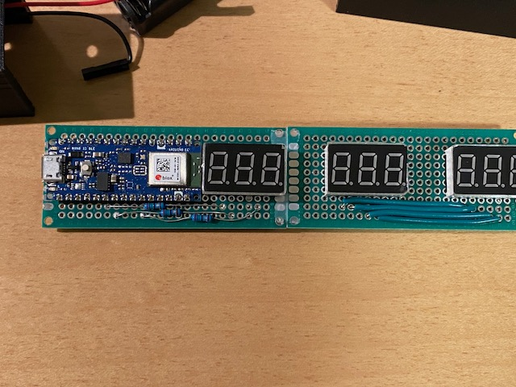

Here's the final case I settled on, after about 10 attempts.

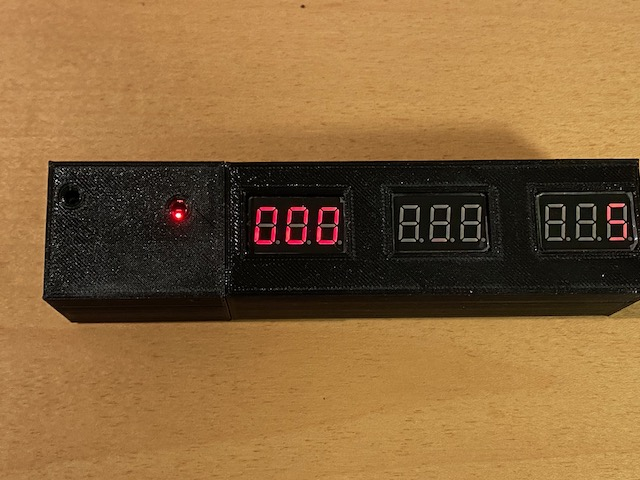

## Bill of Materials

| Part | Cost Total | Cost for this project |
| ---- | ---------- | --------- |
| [Arduino Nano 33 BLE](https://smile.amazon.com/gp/product/B07WV59YTZ/) | $23.00 each | 2 for $46.00 |
| [LED Displays](https://smile.amazon.com/gp/product/B07GTQS4N5) | $8.59 for 5 | 3 for $5.16 |
| [PCB boards](https://smile.amazon.com/gp/product/B072Z7Y19F) | $9.99 for 32 | 3 for $0.94 |
| [Rocker Switches](https://smile.amazon.com/gp/product/B07JNNXC9N) | $6.99 for 20 | 2 for $0.70 |
| [Battery cases](https://smile.amazon.com/gp/product/B07F3YKGPD) | $4.99 for 6 | 4 for $3.33 |
| [Rechargeable AAA batteries](https://smile.amazon.com/gp/product/B00JHKSMIG) | $16.57 for 8 | 8 for $16.57 |
| [Strain Gauges](https://smile.amazon.com/gp/product/B085W5KSSD) | $4.75 for 10 | 4 for $1.90 |
| [HX711 Load Cell Amplifiers](https://smile.amazon.com/gp/product/B07MTYT95R) | $6.99 for 5 | 1 for $1.40 |
| Total | $104.87 | $76.00 |

Some things, I already had, such as a soldering iron, multimeter, wiring, wire strippers, crimpers, 3d printer with filament, etc, so I'm not including the cost of those.  But for someone new, your upfront costs might be more.

So for $76 plus about $30 of extra parts, I have a power, resistance, and cadence meter.  If I [google for power meters](https://lmgtfy.app/?q=power+meter) alone, the cheapest one I see is about $300, and they get much more expensive than that quickly.  Maybe you already have batteries.

## Future work

I haven't looked at current draw yet.  If the batteries start draining too quickly, I'll have to look at that and likely just sleep longer between sampling and transmitting.

I'd also like to figure out the mysterious (7/6) factor for the cadence.

I could probably also spend more time calibrating the power, but the whole point is that it's an objective measure.  For that, I think the current numbers serve the purpose.

Hope you've enjoyed.  If you end up building something similar, or have any advice, feel free to reach out.
